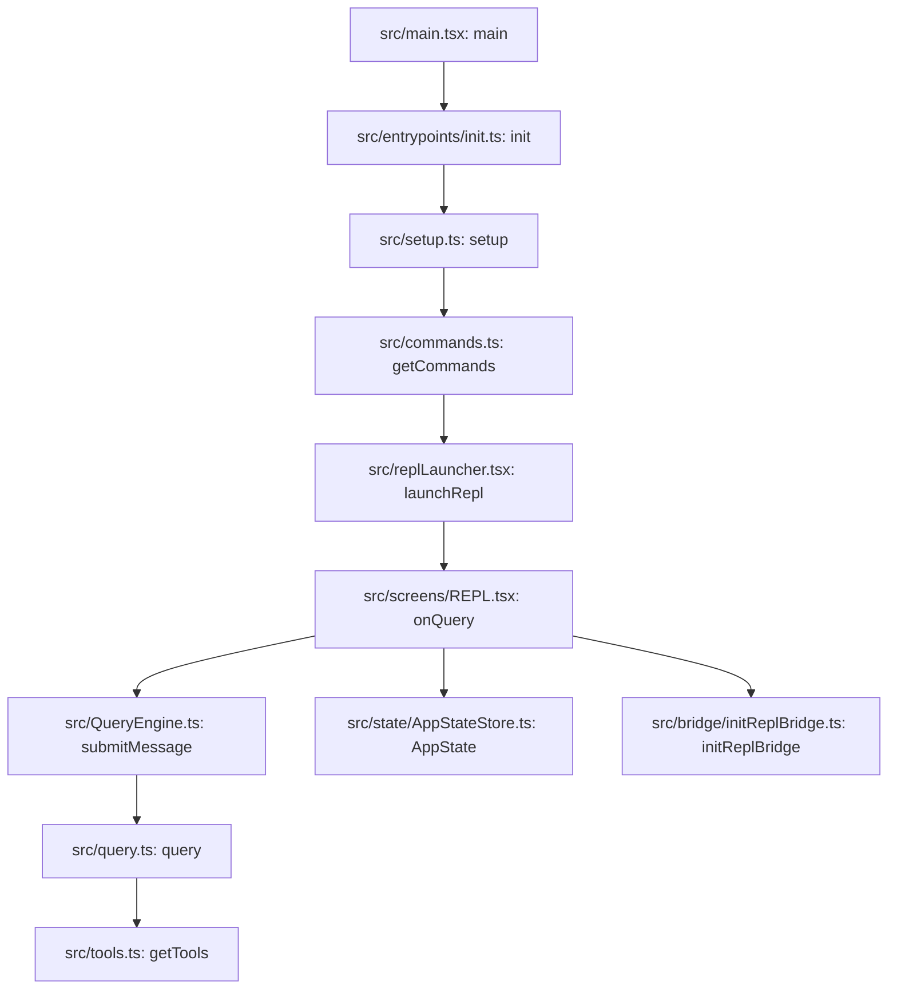

# Claude Code Backup: Architecture Analysis

Last updated: 2026-03-31

This document captures a practical codebase orientation for the current workspace. It focuses on execution flow, command and tool orchestration, bridge integration, state model, and safe extension points.

## Architecture Flow Diagram

### Diagram Legend

1. file:function node: concrete implementation anchor in the codebase
2. gate or decision node: runtime branch or eligibility check
3. loop edge: repeated execution path across turns or polling intervals
4. side-effect node: state sync, enqueue, notification, or transport action

### Where to Breakpoint First

1. [src/main.tsx](../src/main.tsx#L585) at `main` for top-level mode and argv flow
2. [src/main.tsx](../src/main.tsx#L1006) at default action handler entry
3. [src/screens/REPL.tsx](../src/screens/REPL.tsx#L2855) at `onQuery` for turn dispatch
4. [src/QueryEngine.ts](../src/QueryEngine.ts#L209) at `submitMessage` for turn lifecycle

Focused subsystem maps:

1. Query and tool subsystem: [docs/subsystems/query-tool-subsystem-map.md](subsystems/query-tool-subsystem-map.md)
2. Bridge subsystem: [docs/subsystems/bridge-subsystem-map.md](subsystems/bridge-subsystem-map.md)
3. Command subsystem: [docs/subsystems/command-subsystem-map.md](subsystems/command-subsystem-map.md)
4. State and tasks subsystem: [docs/subsystems/state-tasks-subsystem-map.md](subsystems/state-tasks-subsystem-map.md)

## 1) Runtime Boot and Session Startup

1. Process entry starts in [src/main.tsx](../src/main.tsx#L585).
2. CLI builder and option wiring are initialized in [src/main.tsx](../src/main.tsx#L884).
3. Pre-command initialization runs via Commander preAction hook in [src/main.tsx](../src/main.tsx#L907).
4. Core one-time initialization is memoized in [src/entrypoints/init.ts](../src/entrypoints/init.ts#L57).
5. Main action handler begins in [src/main.tsx](../src/main.tsx#L1006).
6. Setup plus command/agent loading are coordinated in [src/main.tsx](../src/main.tsx#L1903), [src/main.tsx](../src/main.tsx#L1927), and [src/main.tsx](../src/main.tsx#L2029).
7. REPL render handoff happens through [src/replLauncher.tsx](../src/replLauncher.tsx#L12).

## 2) Command System

Command composition and lookup are centralized in [src/commands.ts](../src/commands.ts).

- Built-in command list assembly: [src/commands.ts](../src/commands.ts#L258)
- Resolved command list for cwd: [src/commands.ts](../src/commands.ts#L476)
- Command lookup and validation: [src/commands.ts](../src/commands.ts#L704)

Observations:

- Commands are loaded from multiple sources: built-ins, bundled/plugin skills, dynamic skills, and workflows.
- The system favors memoized expensive loading while keeping availability checks fresh.
- Remote-safe and bridge-safe filtering are explicit and allowlisted.

## 3) Query and Tool Orchestration

Core turn execution is in [src/QueryEngine.ts](../src/QueryEngine.ts).

- Query engine class: [src/QueryEngine.ts](../src/QueryEngine.ts#L184)
- Turn submission generator: [src/QueryEngine.ts](../src/QueryEngine.ts#L209)

REPL side query control is in [src/screens/REPL.tsx](../src/screens/REPL.tsx).

- Turn implementation callback: [src/screens/REPL.tsx](../src/screens/REPL.tsx#L2661)
- Turn dispatch and concurrency guard: [src/screens/REPL.tsx](../src/screens/REPL.tsx#L2855)

Tool pool construction is in [src/tools.ts](../src/tools.ts).

- Base tool inventory: [src/tools.ts](../src/tools.ts#L193)
- Built-in tool filtering by mode/permissions: [src/tools.ts](../src/tools.ts#L271)
- Built-in + MCP pool assembly: [src/tools.ts](../src/tools.ts#L345)
- Merged tools helper: [src/tools.ts](../src/tools.ts#L383)

Observations:

- The engine uses iterative model-call and tool-call loops.
- Tool availability is shaped by permissions, mode, feature flags, and MCP contributions.
- REPL manages stream updates, guardrails, and UI synchronization for long-running turns.

## 4) Bridge Subsystem (IDE and Remote Control)

Bridge entry points:

- REPL bridge initialization: [src/bridge/initReplBridge.ts](../src/bridge/initReplBridge.ts#L110)
- Bridge worker loop: [src/bridge/bridgeMain.ts](../src/bridge/bridgeMain.ts#L137)

Observations:

- The bridge is heavily gated by runtime flags, auth state, policy, and version checks.
- Session lifecycle, polling/backoff, and heartbeat handling are explicit and robust.
- Inbound/outbound behavior has dedicated modes to support mirror-like scenarios.

## 5) State, Tasks, and Memory

Global app state is defined in [src/state/AppStateStore.ts](../src/state/AppStateStore.ts#L89).

Observations:

- AppState is large and includes UI state, bridge state, tasks, MCP/plugin state, and permission context.
- Task types are modeled separately under src/tasks and surfaced through shared state.
- Memory prompt shaping and truncation safeguards are in [src/memdir/memdir.ts](../src/memdir/memdir.ts#L57).

## 6) Practical Dependency Map

High-level flow:

1. main.tsx
2. entrypoints/init.ts
3. setup + commands/agents load
4. replLauncher.tsx
5. screens/REPL.tsx
6. QueryEngine.ts
7. tools.ts + Tool implementations
8. services (api, mcp, analytics, lsp)
9. bridge subsystem (when enabled)

## 7) Safe Extension Points

1. Add a slash command via src/commands and register in [src/commands.ts](../src/commands.ts#L258).
2. Add a tool implementation and wire into [src/tools.ts](../src/tools.ts#L193).
3. Adjust turn behavior in [src/QueryEngine.ts](../src/QueryEngine.ts#L209) with care for streaming semantics.
4. Extend bridge behavior via [src/bridge/initReplBridge.ts](../src/bridge/initReplBridge.ts#L110) and [src/bridge/bridgeMain.ts](../src/bridge/bridgeMain.ts#L137).

## 8) Debugging Hotspots

1. Startup sequencing and mode normalization in [src/main.tsx](../src/main.tsx#L1006).
2. Turn orchestration and stream event handling in [src/screens/REPL.tsx](../src/screens/REPL.tsx#L2661).
3. Tool-call loop behavior and retries in [src/QueryEngine.ts](../src/QueryEngine.ts#L209).
4. Bridge polling/reconnect/heartbeat in [src/bridge/bridgeMain.ts](../src/bridge/bridgeMain.ts#L137).

## 9) First Tasks for a New Contributor

1. Trace one command end-to-end: command registration -> REPL submit -> QueryEngine submitMessage.
2. Trace one tool end-to-end: tool registration -> model tool call -> execution -> streamed output.
3. Run a bridge-enabled session and inspect state transitions for connected/reconnecting/failed states.

