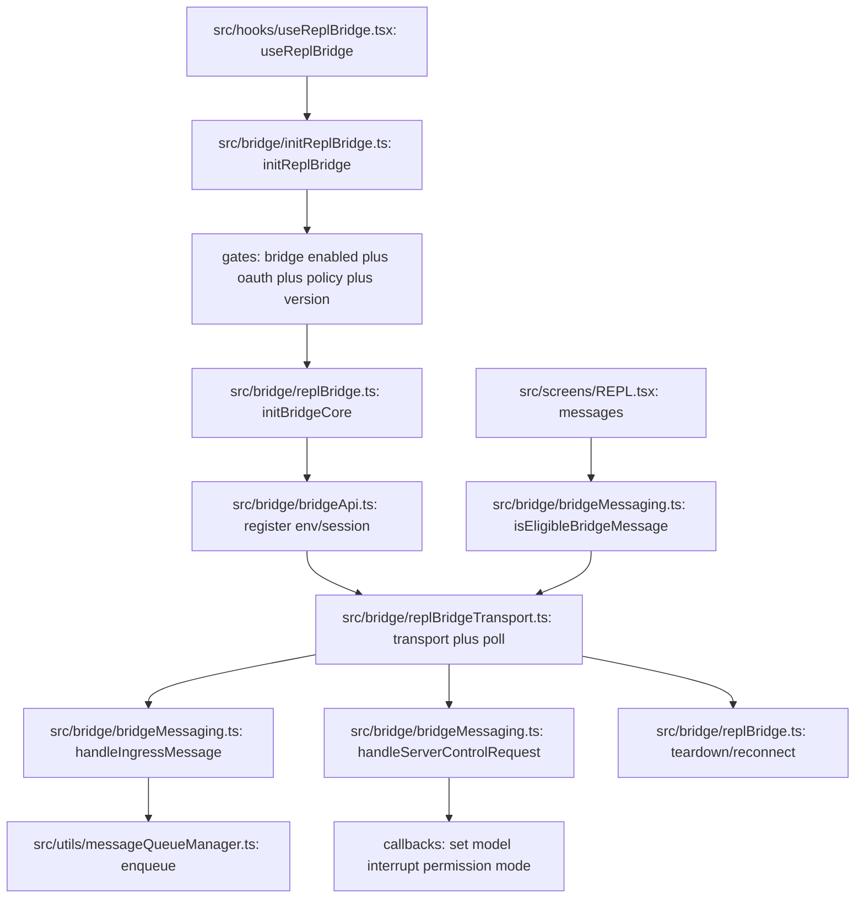

# Bridge Subsystem Map

Last updated: 2026-03-31

This focused map explains the bridge subsystem that connects local CLI sessions with remote control surfaces.

## Flow Diagram

### Diagram Legend

1. file:function node: concrete implementation anchor in the codebase
2. gate node: feature/auth/policy/version eligibility checks
3. transport node: ingress/egress/control message processing path
4. lifecycle node: init, reconnect, or teardown transition

### Where to Breakpoint First

1. [src/hooks/useReplBridge.tsx](../../src/hooks/useReplBridge.tsx#L53) at `useReplBridge`
2. [src/bridge/initReplBridge.ts](../../src/bridge/initReplBridge.ts#L110) at `initReplBridge`
3. [src/bridge/replBridge.ts](../../src/bridge/replBridge.ts#L260) at `initBridgeCore`
4. [src/bridge/bridgeMessaging.ts](../../src/bridge/bridgeMessaging.ts#L132) at `handleIngressMessage`
5. [src/bridge/bridgeMessaging.ts](../../src/bridge/bridgeMessaging.ts#L243) at `handleServerControlRequest`

## Scope

Subsystem boundary includes:

1. REPL bridge wrapper and gating in [src/bridge/initReplBridge.ts](../../src/bridge/initReplBridge.ts#L110)
2. Bootstrap-free core bridge lifecycle in [src/bridge/replBridge.ts](../../src/bridge/replBridge.ts#L260)
3. Bridge worker loop and work polling in [src/bridge/bridgeMain.ts](../../src/bridge/bridgeMain.ts#L141)
4. Ingress/control message routing in [src/bridge/bridgeMessaging.ts](../../src/bridge/bridgeMessaging.ts#L132) and [src/bridge/bridgeMessaging.ts](../../src/bridge/bridgeMessaging.ts#L243)
5. REPL hook integration in [src/hooks/useReplBridge.tsx](../../src/hooks/useReplBridge.tsx#L53)
6. Permission callback contracts in [src/bridge/bridgePermissionCallbacks.ts](../../src/bridge/bridgePermissionCallbacks.ts#L10)

## Lifecycle Overview

1. useReplBridge observes enablement and starts bridge initialization from [src/hooks/useReplBridge.tsx](../../src/hooks/useReplBridge.tsx#L53).
2. initReplBridge performs gate checks: feature flags, auth, policy constraints, and version compatibility in [src/bridge/initReplBridge.ts](../../src/bridge/initReplBridge.ts#L110).
3. initReplBridge delegates to initBridgeCore, passing explicit runtime params instead of relying on bootstrap globals in [src/bridge/replBridge.ts](../../src/bridge/replBridge.ts#L260).
4. initBridgeCore registers environment and creates or reconnects session, then starts transport and polling loops.
5. As messages flow, inbound user messages are enqueued to REPL and outbound eligible messages are forwarded.
6. Teardown path archives/deregisters as appropriate, or preserves pointer state in perpetual mode.

## Core Contracts

Bridge core state and handle shape:

1. Bridge state enum in [src/bridge/replBridge.ts](../../src/bridge/replBridge.ts#L83)
2. REPL bridge handle in [src/bridge/replBridge.ts](../../src/bridge/replBridge.ts#L70)
3. Core initialization params in [src/bridge/replBridge.ts](../../src/bridge/replBridge.ts#L91)

Permission callback contracts:

1. Response contract in [src/bridge/bridgePermissionCallbacks.ts](../../src/bridge/bridgePermissionCallbacks.ts#L3)
2. Callback surface in [src/bridge/bridgePermissionCallbacks.ts](../../src/bridge/bridgePermissionCallbacks.ts#L10)

## Message Flow

### Inbound message path

1. Transport receives data frame.
2. handleIngressMessage parses, normalizes, deduplicates by UUID echo/replay sets, and routes user messages in [src/bridge/bridgeMessaging.ts](../../src/bridge/bridgeMessaging.ts#L132).
3. useReplBridge inbound handler sanitizes and resolves attachments, then enqueues prompt into the REPL queue.

### Server control-request path

1. Server sends control_request.
2. handleServerControlRequest dispatches initialize, set_model, interrupt, max-thinking, and permission mode updates in [src/bridge/bridgeMessaging.ts](../../src/bridge/bridgeMessaging.ts#L243).
3. Outbound-only mode responds with explicit error for mutable requests while preserving initialize handshake.

### Outbound message path

1. REPL updates messages.
2. Bridge filters eligible message types and forwards user, assistant, and selected system local-command messages.
3. UUID tracking avoids self-echo loops and duplicate replay after transport changes.

## Bridge and REPL Integration

useReplBridge responsibilities in [src/hooks/useReplBridge.tsx](../../src/hooks/useReplBridge.tsx#L53):

1. Start and stop bridge based on AppState toggles.
2. Track failures and stop retry storms with consecutive failure fuse.
3. Update AppState bridge fields for ready, connected, reconnecting, and failed states.
4. Inject inbound prompts into local queue.
5. Emit system init payload to remote clients on connect.

## Polling, Reconnect, and Resilience

Bridge loop in [src/bridge/bridgeMain.ts](../../src/bridge/bridgeMain.ts#L141) handles:

1. Work poll heartbeat with backoff and give-up windows.
2. Session handle tracking and timeout enforcement.
3. Capacity wake behavior when work completes.
4. Token refresh and transient auth/error classification.

Resilience patterns:

1. Bounded UUID sets to suppress echo and replay duplicates.
2. Poll loop backoff with explicit thresholds.
3. Hook-level consecutive failure fuse to prevent repeated failed registration attempts.
4. Optional perpetual session behavior for assistant mode continuity.

## Security and Policy Gates

Primary gate checks occur before bridge bring-up in [src/bridge/initReplBridge.ts](../../src/bridge/initReplBridge.ts#L110):

1. Runtime feature gate.
2. OAuth availability.
3. Organization policy checks.
4. Minimum version compatibility for active bridge mode.

## Debugging Hotspots

1. Initialization failures and retry behavior in [src/hooks/useReplBridge.tsx](../../src/hooks/useReplBridge.tsx#L53).
2. Control-request handling mismatches in [src/bridge/bridgeMessaging.ts](../../src/bridge/bridgeMessaging.ts#L243).
3. Inbound dedup and missing prompt injection in [src/bridge/bridgeMessaging.ts](../../src/bridge/bridgeMessaging.ts#L132).
4. Work-poll backoff and session lifecycle race conditions in [src/bridge/bridgeMain.ts](../../src/bridge/bridgeMain.ts#L141).

## Safe Extension Points

1. Add new control subtypes by extending handler routing in [src/bridge/bridgeMessaging.ts](../../src/bridge/bridgeMessaging.ts#L243) and wiring callbacks through bridge core params.
2. Add bridge status UX by extending AppState transitions from useReplBridge.
3. Add transport-independent behavior in initBridgeCore rather than REPL wrapper for reuse across bridge variants.

## Quick Trace Recipe

1. Enable bridge and watch state transitions from not connected to ready to connected.
2. Send a remote prompt and confirm handleIngressMessage UUID path and queue injection.
3. Trigger a control request and verify response shape and outbound-only behavior.
4. Force a transient network error and observe backoff/reconnect sequence.
