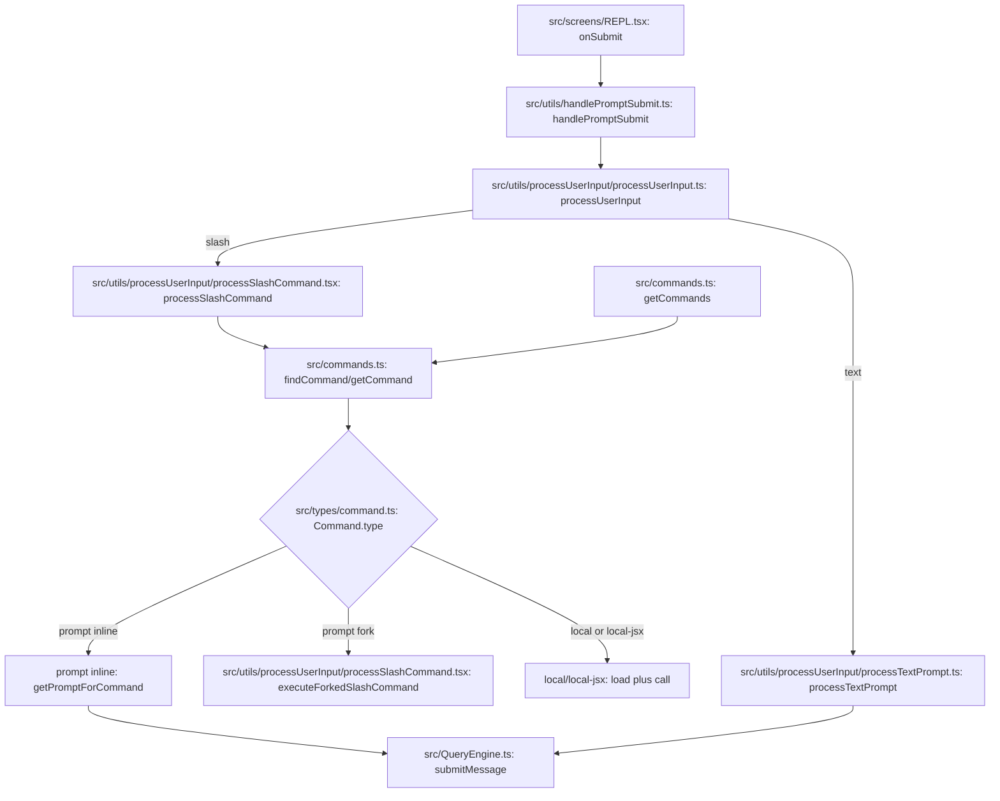

# Command Subsystem Map

Last updated: 2026-03-31

This focused map explains command registration, availability filtering, and runtime command dispatch from user input to execution.

## Flow Diagram

### Diagram Legend

1. file:function node: concrete implementation anchor in the codebase
2. decision node: branch by command type, mode, or eligibility
3. registry node: command discovery, filtering, or lookup source
4. terminal node: handoff to query/model execution or local execution path

### Where to Breakpoint First

1. [src/utils/handlePromptSubmit.ts](../../src/utils/handlePromptSubmit.ts#L120) at `handlePromptSubmit`
2. [src/utils/processUserInput/processUserInput.ts](../../src/utils/processUserInput/processUserInput.ts#L85) at `processUserInput`
3. [src/utils/processUserInput/processSlashCommand.tsx](../../src/utils/processUserInput/processSlashCommand.tsx#L309) at `processSlashCommand`
4. [src/commands.ts](../../src/commands.ts#L704) at `getCommand` for strict resolution failures

## Scope

Subsystem boundary includes:

1. Command contracts in [src/types/command.ts](../../src/types/command.ts#L25)
2. Command registry and loading in [src/commands.ts](../../src/commands.ts#L258), [src/commands.ts](../../src/commands.ts#L449), and [src/commands.ts](../../src/commands.ts#L476)
3. Skill-facing command views in [src/commands.ts](../../src/commands.ts#L563) and [src/commands.ts](../../src/commands.ts#L586)
4. Lookup and safety filters in [src/commands.ts](../../src/commands.ts#L672), [src/commands.ts](../../src/commands.ts#L684), [src/commands.ts](../../src/commands.ts#L688), and [src/commands.ts](../../src/commands.ts#L704)
5. Prompt submission and routing in [src/utils/handlePromptSubmit.ts](../../src/utils/handlePromptSubmit.ts#L120)
6. Input-mode dispatch in [src/utils/processUserInput/processUserInput.ts](../../src/utils/processUserInput/processUserInput.ts#L85)
7. Slash-command execution in [src/utils/processUserInput/processSlashCommand.tsx](../../src/utils/processUserInput/processSlashCommand.tsx#L309)

## Command Type Model

Core command variants are defined in [src/types/command.ts](../../src/types/command.ts):

1. PromptCommand in [src/types/command.ts](../../src/types/command.ts#L25)
2. Local command module shape in [src/types/command.ts](../../src/types/command.ts#L70)
3. Local JSX command context in [src/types/command.ts](../../src/types/command.ts#L80)

Operational meaning:

1. prompt commands expand into model-visible content blocks
2. local commands execute logic and return text or compact directives
3. local-jsx commands render interactive UI flows in the REPL

## Registry and Loading Pipeline

### Built-in registry

Built-ins are assembled lazily in [src/commands.ts](../../src/commands.ts#L258).

### Multi-source loading

All command sources are combined in [src/commands.ts](../../src/commands.ts#L449):

1. bundled skills
2. built-in plugin skills
3. skill-directory commands
4. workflow commands
5. plugin commands and skills
6. built-in command registry

### Runtime availability resolution

Final per-cwd command list is built in [src/commands.ts](../../src/commands.ts#L476), including:

1. availability checks based on auth/provider
2. isEnabled checks
3. dynamic-skill dedupe and insertion rules

### Skill views for model invocation

1. broader skill tool view in [src/commands.ts](../../src/commands.ts#L563)
2. slash-command tool skill view in [src/commands.ts](../../src/commands.ts#L586)

## Startup Integration

Commands are loaded during startup and joined with setup in [src/main.tsx](../../src/main.tsx#L2029), with pre-setup kick-off around [src/main.tsx](../../src/main.tsx#L1927).

## Dispatch Path: User Input to Command Execution

### Entry point from REPL submit

REPL delegates prompt processing to handlePromptSubmit in [src/screens/REPL.tsx](../../src/screens/REPL.tsx#L3490) using the submission core in [src/utils/handlePromptSubmit.ts](../../src/utils/handlePromptSubmit.ts#L120).

### Submission core responsibilities

handlePromptSubmit:

1. handles queue-path and direct-input path
2. expands pasted references and validates immediate command behavior
3. routes into processUserInput for mode-specific parsing and command/text behavior

### Mode-specific routing

processUserInput in [src/utils/processUserInput/processUserInput.ts](../../src/utils/processUserInput/processUserInput.ts#L85) routes by mode and prefix:

1. bash mode to bash command path
2. slash-prefixed prompt to slash processor
3. otherwise regular text prompt path

### Slash command processing

processSlashCommand in [src/utils/processUserInput/processSlashCommand.tsx](../../src/utils/processUserInput/processSlashCommand.tsx#L309):

1. parses slash command and args
2. resolves command by name and aliases
3. handles unknown-command behavior
4. executes by command type:
   1. prompt inline expansion
   2. prompt forked context using sub-agent path via executeForkedSlashCommand in [src/utils/processUserInput/processSlashCommand.tsx](../../src/utils/processUserInput/processSlashCommand.tsx#L62)
   3. local or local-jsx execution paths

## Safety and Surface Filters

### Bridge-safe and remote-safe filters

1. bridge safety predicate in [src/commands.ts](../../src/commands.ts#L672)
2. remote-mode filtering in [src/commands.ts](../../src/commands.ts#L684)

### Lookup behavior

1. canonical find in [src/commands.ts](../../src/commands.ts#L688)
2. strict get with explicit error on missing command in [src/commands.ts](../../src/commands.ts#L704)

## Debugging Hotspots

1. command-source merge and cache invalidation in [src/commands.ts](../../src/commands.ts#L449)
2. dynamic skill insertion order in [src/commands.ts](../../src/commands.ts#L476)
3. slash parsing and fallback behavior in [src/utils/processUserInput/processSlashCommand.tsx](../../src/utils/processUserInput/processSlashCommand.tsx#L309)
4. immediate command handling under loading and queue pressure in [src/utils/handlePromptSubmit.ts](../../src/utils/handlePromptSubmit.ts#L120)

## Safe Extension Points

1. add a built-in command module and register in [src/commands.ts](../../src/commands.ts#L258)
2. add a new command source integration by extending [src/commands.ts](../../src/commands.ts#L449)
3. add command-level policy or surface filtering through [src/commands.ts](../../src/commands.ts#L672)
4. add slash behavior in [src/utils/processUserInput/processSlashCommand.tsx](../../src/utils/processUserInput/processSlashCommand.tsx#L309) while preserving command type contracts

## Quick Trace Recipe

1. set a breakpoint at [src/utils/handlePromptSubmit.ts](../../src/utils/handlePromptSubmit.ts#L120)
2. submit a slash command and step into [src/utils/processUserInput/processUserInput.ts](../../src/utils/processUserInput/processUserInput.ts#L85)
3. follow slash resolution in [src/utils/processUserInput/processSlashCommand.tsx](../../src/utils/processUserInput/processSlashCommand.tsx#L309)
4. verify command lookup in [src/commands.ts](../../src/commands.ts#L704)
5. verify final messages and shouldQuery behavior returned to REPL
