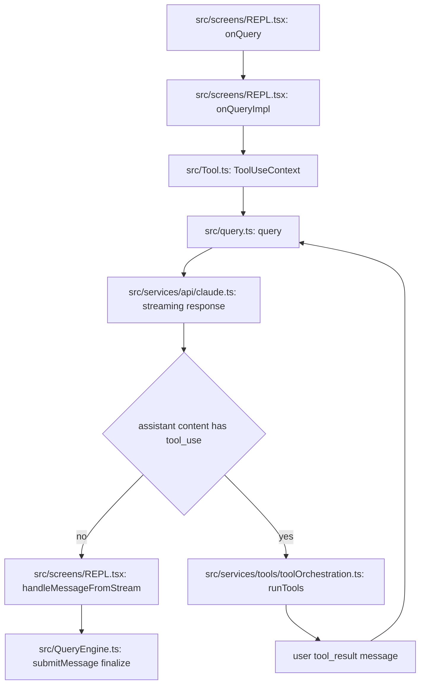

# Query and Tool Subsystem Map

Last updated: 2026-03-31

This focused map explains how one user turn moves from REPL input through model streaming, tool execution, and final assistant output.

## Flow Diagram

### Diagram Legend

1. file:function node: concrete implementation anchor in the codebase
2. decision node: branch on streamed assistant/tool state
3. loop edge: tool_result returns control to the query loop
4. finalize node: end-of-turn state cleanup and completion

### Where to Breakpoint First

1. [src/screens/REPL.tsx](../../src/screens/REPL.tsx#L2855) at `onQuery`
2. [src/screens/REPL.tsx](../../src/screens/REPL.tsx#L2661) at `onQueryImpl`
3. [src/QueryEngine.ts](../../src/QueryEngine.ts#L209) at `submitMessage`
4. [src/query.ts](../../src/query.ts#L219) at `query`
5. [src/tools.ts](../../src/tools.ts#L271) at `getTools` when tool availability is unexpected

## Scope

Subsystem boundary includes:

1. REPL query orchestration in [src/screens/REPL.tsx](../../src/screens/REPL.tsx#L2661) and [src/screens/REPL.tsx](../../src/screens/REPL.tsx#L2855)
2. Query engine turn lifecycle in [src/QueryEngine.ts](../../src/QueryEngine.ts#L184) and [src/QueryEngine.ts](../../src/QueryEngine.ts#L209)
3. Query loop and transition handling in [src/query.ts](../../src/query.ts#L219)
4. Tool contracts in [src/Tool.ts](../../src/Tool.ts#L158)
5. Tool pool assembly in [src/tools.ts](../../src/tools.ts#L193) and [src/tools.ts](../../src/tools.ts#L271)

## One Turn Lifecycle

1. User submits prompt in REPL.
2. REPL concurrency guard accepts or queues the request in [src/screens/REPL.tsx](../../src/screens/REPL.tsx#L2855).
3. REPL prepares ToolUseContext, model context, and effective system prompt in [src/screens/REPL.tsx](../../src/screens/REPL.tsx#L2661).
4. REPL calls query loop and streams events in [src/screens/REPL.tsx](../../src/screens/REPL.tsx#L2661).
5. Query engine and query loop normalize messages, apply compact or retry transitions, and issue model calls in [src/QueryEngine.ts](../../src/QueryEngine.ts#L209) and [src/query.ts](../../src/query.ts#L219).
6. If model emits tool_use blocks, orchestration routes to registered tool implementations via ToolUseContext.
7. Tool progress and results are appended as stream events and messages.
8. Loop continues until terminal condition is reached and assistant turn finalizes.

## Runtime Responsibilities by Layer

### REPL layer

1. Owns UI-facing state transitions and streaming updates.
2. Batches and appends messages safely.
3. Builds current turn ToolUseContext using fresh tool and MCP state.
4. Handles interruption and turn-level metrics.

Primary anchors:

1. [src/screens/REPL.tsx](../../src/screens/REPL.tsx#L2661)
2. [src/screens/REPL.tsx](../../src/screens/REPL.tsx#L2855)

### Query engine layer

1. Owns session-level mutable conversation state in class instance.
2. Wraps permission checks and denial tracking.
3. Coordinates prompt processing, memory loading, and submit semantics.

Primary anchors:

1. [src/QueryEngine.ts](../../src/QueryEngine.ts#L184)
2. [src/QueryEngine.ts](../../src/QueryEngine.ts#L209)

### Query loop layer

1. Owns iterative model call and transition mechanics.
2. Handles compact strategies, token budget checks, stop hooks, retries, and fallback behavior.
3. Emits stream events and terminal state.

Primary anchor:

1. [src/query.ts](../../src/query.ts#L219)

### Tool contract and registry layer

1. Defines ToolUseContext data plane and callbacks in [src/Tool.ts](../../src/Tool.ts#L158).
2. Defines tool availability and filtering in [src/tools.ts](../../src/tools.ts#L271).
3. Defines base inventory in [src/tools.ts](../../src/tools.ts#L193).

## Data Flow Contracts

## Query inputs

1. Messages history
2. Effective system prompt
3. User and system context maps
4. ToolUseContext with app state getters and mutation callbacks
5. Permission evaluator and tool inventory

## Query outputs

1. Stream events for partial text and tool progress
2. Assistant, user tool_result, and system messages
3. Terminal outcome from query loop

## ToolUseContext highlights

From [src/Tool.ts](../../src/Tool.ts#L158):

1. options with commands, tools, model, mcp clients, and session mode
2. getAppState and setAppState hooks for stateful tool behavior
3. abort controller for cooperative cancellation
4. message and response-length update hooks for live streaming behavior
5. file history and attribution update hooks

## Sequence View

1. REPL onQuery accepts turn.
2. REPL onQueryImpl prepares context and invokes query.
3. query loop sends request to model.
4. model emits content and optionally tool_use.
5. tool orchestration executes matching tool.
6. tool results return to query loop as tool_result blocks.
7. model continues until end_turn.
8. REPL finalizes loading state and post-turn side effects.

## Hotspots and Failure Modes

## High-complexity hotspots

1. Turn orchestration and event fan-out in [src/screens/REPL.tsx](../../src/screens/REPL.tsx#L2661)
2. Query loop transitions and recovery logic in [src/query.ts](../../src/query.ts#L219)
3. Session-state mutation in QueryEngine submit path in [src/QueryEngine.ts](../../src/QueryEngine.ts#L209)

## Common failure classes

1. Tool permission mismatch causing denied tool paths
2. Message growth and compact boundary side effects
3. Partial stream handling bugs that desync UI state
4. Inconsistent tool inventory when MCP state changes mid-turn

## Safe Extension Points

1. Add a new tool and register in [src/tools.ts](../../src/tools.ts#L193), then ensure isEnabled logic integrates with [src/tools.ts](../../src/tools.ts#L271).
2. Add query transition behavior in [src/query.ts](../../src/query.ts#L219) with explicit terminal and continue paths.
3. Add turn-level observability in REPL around [src/screens/REPL.tsx](../../src/screens/REPL.tsx#L2661) without mutating message semantics.

## Debug Playbook

1. Start at REPL onQuery and confirm one active generation guard.
2. Confirm effective tool pool from permission context and MCP state.
3. Trace query loop transitions and terminal reason.
4. Validate tool execution lifecycle from tool_use to tool_result.
5. Check compact and token-budget paths when outputs are truncated or retried.

## Suggested Next Focus

If you want the next subsystem pass, choose one:

1. Bridge subsystem map
2. Command subsystem map
3. State and tasks subsystem map
