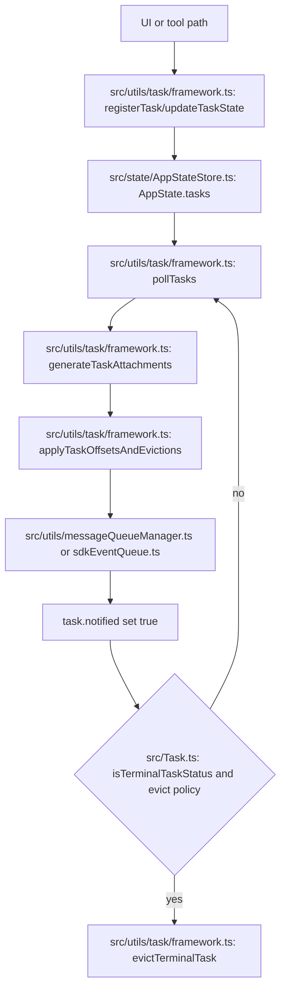

# State and Tasks Subsystem Map

Last updated: 2026-03-31

This focused map explains how global app state is modeled, updated, and synchronized, and how background task lifecycles are registered, polled, notified, and evicted.

## Flow Diagram

### Diagram Legend

1. file:function node: concrete implementation anchor in the codebase
2. state node: AppState or task-state mutation checkpoint
3. loop edge: polling and delta-application cycle
4. terminal node: notification and eviction lifecycle stage

### Where to Breakpoint First

1. [src/utils/task/framework.ts](../../src/utils/task/framework.ts#L77) at `registerTask`
2. [src/utils/task/framework.ts](../../src/utils/task/framework.ts#L48) at `updateTaskState`
3. [src/utils/task/framework.ts](../../src/utils/task/framework.ts#L255) at `pollTasks`
4. [src/tasks/stopTask.ts](../../src/tasks/stopTask.ts#L38) at `stopTask`
5. [src/state/onChangeAppState.ts](../../src/state/onChangeAppState.ts#L43) at `onChangeAppState` for side-effect sync

## Scope

Subsystem boundary includes:

1. AppState model in [src/state/AppStateStore.ts](../../src/state/AppStateStore.ts#L89)
2. Default state initialization in [src/state/AppStateStore.ts](../../src/state/AppStateStore.ts#L456)
3. Store implementation in [src/state/store.ts](../../src/state/store.ts#L10)
4. State side-effect synchronizer in [src/state/onChangeAppState.ts](../../src/state/onChangeAppState.ts#L43)
5. Core task contracts in [src/Task.ts](../../src/Task.ts#L6) and [src/Task.ts](../../src/Task.ts#L72)
6. Task registry in [src/tasks.ts](../../src/tasks.ts#L22)
7. Task framework helpers in [src/utils/task/framework.ts](../../src/utils/task/framework.ts#L48)

## State Model

Primary AppState type is declared in [src/state/AppStateStore.ts](../../src/state/AppStateStore.ts#L89).

High-impact state slices:

1. permissions and mode context
2. bridge lifecycle and connection metadata
3. tasks dictionary and foreground/view state
4. MCP and plugin inventories
5. notifications and elicitation queues
6. prompt suggestion and speculation state

Default initialization is centralized in [src/state/AppStateStore.ts](../../src/state/AppStateStore.ts#L456).

## Store Semantics

Store implementation in [src/state/store.ts](../../src/state/store.ts#L10) provides:

1. getState
2. setState with structural no-op short-circuit
3. subscribe and unsubscribe

State transition side effects are handled by [src/state/onChangeAppState.ts](../../src/state/onChangeAppState.ts#L43), including:

1. permission mode external sync
2. model setting persistence and overrides
3. persisted UI preference sync
4. environment-variable re-application on relevant settings changes

## Task Contract Layer

Task primitives in [src/Task.ts](../../src/Task.ts):

1. TaskType enum-like union in [src/Task.ts](../../src/Task.ts#L6)
2. TaskStatus lifecycle in [src/Task.ts](../../src/Task.ts#L15)
3. terminal-status helper in [src/Task.ts](../../src/Task.ts#L27)
4. base state shape in [src/Task.ts](../../src/Task.ts#L45)
5. task interface in [src/Task.ts](../../src/Task.ts#L72)
6. id and base-state constructors in [src/Task.ts](../../src/Task.ts#L98) and [src/Task.ts](../../src/Task.ts#L108)

Task registry and dynamic inclusion are defined in:

1. [src/tasks.ts](../../src/tasks.ts#L22)
2. [src/tasks.ts](../../src/tasks.ts#L37)

Union task-state typing is in [src/tasks/types.ts](../../src/tasks/types.ts#L12).

## Task Framework Lifecycle

Shared task framework in [src/utils/task/framework.ts](../../src/utils/task/framework.ts#L48) handles:

1. immutable per-task updates
2. task registration and SDK task_started emission
3. terminal-task eviction gates
4. task-output delta generation
5. offset patch application and safe eviction merge
6. periodic polling orchestration

Key anchors:

1. [src/utils/task/framework.ts](../../src/utils/task/framework.ts#L48)
2. [src/utils/task/framework.ts](../../src/utils/task/framework.ts#L77)
3. [src/utils/task/framework.ts](../../src/utils/task/framework.ts#L125)
4. [src/utils/task/framework.ts](../../src/utils/task/framework.ts#L158)
5. [src/utils/task/framework.ts](../../src/utils/task/framework.ts#L213)
6. [src/utils/task/framework.ts](../../src/utils/task/framework.ts#L255)

## Concrete Task Implementations

### Local shell task

Core implementation in [src/tasks/LocalShellTask/LocalShellTask.tsx](../../src/tasks/LocalShellTask/LocalShellTask.tsx#L173).

Key operations:

1. spawn and background shell execution in [src/tasks/LocalShellTask/LocalShellTask.tsx](../../src/tasks/LocalShellTask/LocalShellTask.tsx#L180)
2. foreground registration path in [src/tasks/LocalShellTask/LocalShellTask.tsx](../../src/tasks/LocalShellTask/LocalShellTask.tsx#L259)
3. prompt-stall watchdog and notification behavior

### Local agent task

Core state and lifecycle in [src/tasks/LocalAgentTask/LocalAgentTask.tsx](../../src/tasks/LocalAgentTask/LocalAgentTask.tsx#L116).

Key operations:

1. task interface in [src/tasks/LocalAgentTask/LocalAgentTask.tsx](../../src/tasks/LocalAgentTask/LocalAgentTask.tsx#L270)
2. kill path in [src/tasks/LocalAgentTask/LocalAgentTask.tsx](../../src/tasks/LocalAgentTask/LocalAgentTask.tsx#L281)
3. progress updates in [src/tasks/LocalAgentTask/LocalAgentTask.tsx](../../src/tasks/LocalAgentTask/LocalAgentTask.tsx#L339)
4. registration path in [src/tasks/LocalAgentTask/LocalAgentTask.tsx](../../src/tasks/LocalAgentTask/LocalAgentTask.tsx#L466)

### Remote agent task

Core state and lifecycle in [src/tasks/RemoteAgentTask/RemoteAgentTask.tsx](../../src/tasks/RemoteAgentTask/RemoteAgentTask.tsx#L22).

Key operations:

1. registration in [src/tasks/RemoteAgentTask/RemoteAgentTask.tsx](../../src/tasks/RemoteAgentTask/RemoteAgentTask.tsx#L386)
2. restore path in [src/tasks/RemoteAgentTask/RemoteAgentTask.tsx](../../src/tasks/RemoteAgentTask/RemoteAgentTask.tsx#L477)
3. task interface kill path in [src/tasks/RemoteAgentTask/RemoteAgentTask.tsx](../../src/tasks/RemoteAgentTask/RemoteAgentTask.tsx#L808)

### Main session as background task

Backgrounding the active session is modeled via local_agent state in [src/tasks/LocalMainSessionTask.ts](../../src/tasks/LocalMainSessionTask.ts#L55).

Key operations:

1. register task in [src/tasks/LocalMainSessionTask.ts](../../src/tasks/LocalMainSessionTask.ts#L94)
2. complete task in [src/tasks/LocalMainSessionTask.ts](../../src/tasks/LocalMainSessionTask.ts#L168)
3. spawn detached background session in [src/tasks/LocalMainSessionTask.ts](../../src/tasks/LocalMainSessionTask.ts#L338)

### In-process teammate task

Type and lifecycle for teammate workers:

1. state type in [src/tasks/InProcessTeammateTask/types.ts](../../src/tasks/InProcessTeammateTask/types.ts#L22)
2. message-cap policy in [src/tasks/InProcessTeammateTask/types.ts](../../src/tasks/InProcessTeammateTask/types.ts#L101)
3. task interface in [src/tasks/InProcessTeammateTask/InProcessTeammateTask.tsx](../../src/tasks/InProcessTeammateTask/InProcessTeammateTask.tsx#L24)
4. user injection path in [src/tasks/InProcessTeammateTask/InProcessTeammateTask.tsx](../../src/tasks/InProcessTeammateTask/InProcessTeammateTask.tsx#L68)

### Dream task

Dream task state and lifecycle are in [src/tasks/DreamTask/DreamTask.ts](../../src/tasks/DreamTask/DreamTask.ts#L25), with register/turn/completion at:

1. [src/tasks/DreamTask/DreamTask.ts](../../src/tasks/DreamTask/DreamTask.ts#L52)
2. [src/tasks/DreamTask/DreamTask.ts](../../src/tasks/DreamTask/DreamTask.ts#L76)
3. [src/tasks/DreamTask/DreamTask.ts](../../src/tasks/DreamTask/DreamTask.ts#L106)

## Stop and Notification Path

Common stop flow is implemented in [src/tasks/stopTask.ts](../../src/tasks/stopTask.ts#L38):

1. validate task exists and is running
2. resolve implementation from registry
3. call task-specific kill
4. apply notification suppression or SDK termination event where applicable

## Data Flow Summary

1. UI or tool action creates or updates task via framework helpers.
2. Task output is appended to disk-backed task streams.
3. Poll framework computes deltas and patch offsets.
4. Terminal tasks set notified and become evictable when policy allows.
5. AppState subscribers render updated task and status views.

## Debugging Hotspots

1. state side-effect sync races in [src/state/onChangeAppState.ts](../../src/state/onChangeAppState.ts#L43)
2. task replacement and retention merge semantics in [src/utils/task/framework.ts](../../src/utils/task/framework.ts#L77)
3. terminal-task eviction timing in [src/utils/task/framework.ts](../../src/utils/task/framework.ts#L125)
4. remote task restore and completion checker behavior in [src/tasks/RemoteAgentTask/RemoteAgentTask.tsx](../../src/tasks/RemoteAgentTask/RemoteAgentTask.tsx#L477)
5. main-session backgrounding and transcript isolation in [src/tasks/LocalMainSessionTask.ts](../../src/tasks/LocalMainSessionTask.ts#L94)

## Safe Extension Points

1. add a new TaskType and Task implementation, then register in [src/tasks.ts](../../src/tasks.ts#L22)
2. add new task-state fields with immutable updates via [src/utils/task/framework.ts](../../src/utils/task/framework.ts#L48)
3. add new completion or notification semantics in task-specific modules without bypassing framework registration and notified gates

## Quick Trace Recipe

1. set breakpoint at [src/utils/task/framework.ts](../../src/utils/task/framework.ts#L77)
2. start a background shell or agent task
3. follow state writes through [src/utils/task/framework.ts](../../src/utils/task/framework.ts#L48)
4. trigger completion and inspect notification enqueue path
5. verify eviction behavior through [src/utils/task/framework.ts](../../src/utils/task/framework.ts#L125)
